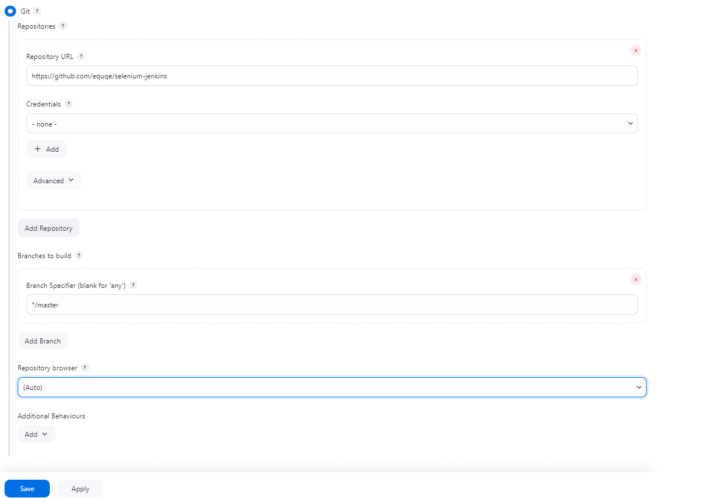
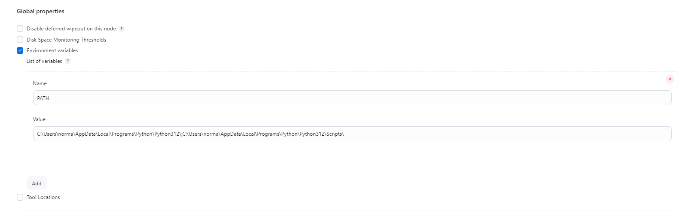

# selenium-jenkins
### версия драйвера chromedriver: 131.0.6778.85

# DEPLOY GUIDE

непосредственно в панели jenkins необходимо совершить действия:
1. New Item

1.1. выберите Freestyle project

2. перейдите в раздел Source code management


3. выберите Git, заполняем Repository URL, после этого примените изменения 


4. в разделе "Build" выберите "Add build step" и выберите "Execute Windows batch command". вставляете следующее:
```
python -m venv venv

call venv\Scripts\activate

pip install -r requirements.txt

set PATH=%PATH%;%cd%\chromedriver

pytest
```

если билд падает с ошибкой из-за того, что jenkins не знает команд pip, python, pytest - убедитесь, что у пользователя jenkins в path есть питон и его библиотеки.

решение:
1. переходите на дэшборд jenkins, клик на manage jenkins, далее system -> global properties (если не можете найти - используйте f3 для быстрого поиска по странице):


2. готово!