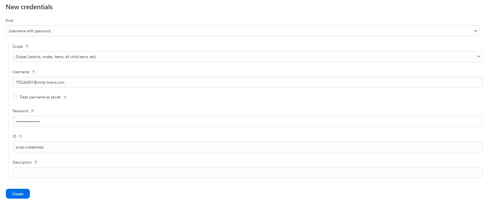

# selenium-jenkins
### версия драйвера chromedriver: 114.0.5735.90
https://chromedriver.storage.googleapis.com/index.html?path=114.0.5735.90/

# деплой

## вместо freestyle project в new item выбирайте pipeline project

в разделе advanced pipeline options нужно добавить нужный url репозитория и указать ветку test

в pipeline выбирайте pipeline script from scm, в выпадающем списке scm - git. далее заполнить форму с ссылкой на репозиторий(формата git clone), указать ветку test.

# важный момент - в additional behaviours выберите clean before checkout

также необходимо разрешить методы и настроить smtp сервер.

сначала нужно добавить credentials для smtp: Manage Jenkins -> Credentials

данные(логин, пароль) берем с smtp сервиса, который предоставил доступы. можно использовать brevo, mailtrap ... от себя порекомендую использовать gmail smtp, быстро и просто. не все smtp сервисы дают нормально зарегистрироваться - можно сразу после регистрации по неизвестным причинам влететь под suspend

хороший туториал для настройки и проверки gmail smtp: https://www.youtube.com/watch?v=ZfEK3WP73eY

для работы пайплайна нужно будет скачать gdrive и авторизоваться, это достаточно просто: https://github.com/glotlabs/gdrive. документация: https://github.com/glotlabs/gdrive/blob/main/docs/create_google_api_credentials.md

## обратите внимание, чтобы пользователю jenkins была доступна конфигурация gdrive. специально добавлена проверка в шаге загрузки на драйв - gdrive acconut list, если список пуст и билд падает - значит пользователь jenkins не видит конфиг gdrive. проблему можно исправить сменой пользователя jenkins/добавлением аккаунта gdrive от имени пользователя jenkins через powershell

как только привязали все в gdrive - зайдите в google drive, создайте папку, ПКМ, затем share, доступ anyone with the link, из ссылки взять идентификатор папки и вставить в jenkinsfile(https://drive.google.com/drive/folders/YOUR_FOLDER_ID?usp=sharing) 

далее Manage Jenkins -> Configure System, раздел Extended E-mail Notification.

заполнять все поля как в credentials, под вводом порта нажать advanced, там выбрать созданный объект credentials.

отправку писем от jenkins также можно проверить в разделе ниже - email notification. заполнить все поля и нажать чекбокс Test configuration by sending test e-mail

получателей можно настроить в recipients.html